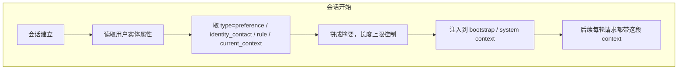
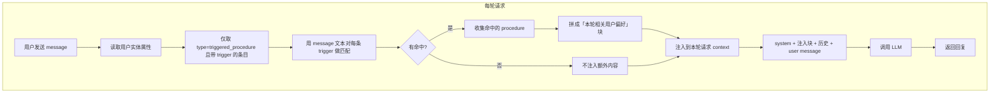
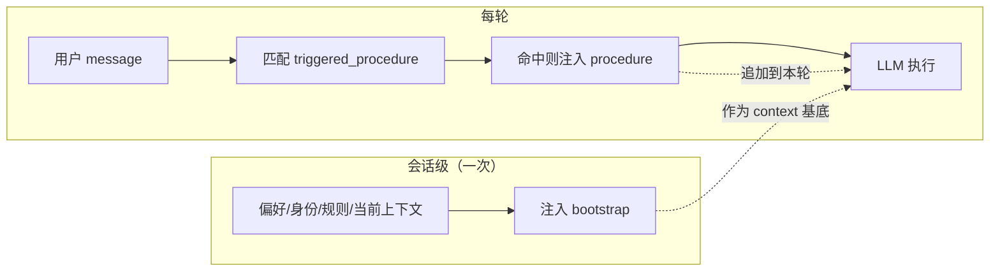

# Entity–State Memory: 实体化建模与状态时间轴

## 背景与动机

当前记忆的痛点：

- **依赖主动触发**：即使用户把设定写进 `MEMORY.md` 或 `memory/小说设定.md`，使用时仍需要“让 LLM 先读”或调用 `memory_search`，容易忘。
- **提示容易被忽略**：在 AGENTS.md 里写“写前先读设定”等技巧，模型仍可能跳过或漏读。
- **非结构化**：纯 Markdown 难以做“按实体 / 按时间点”的精确召回，也难以在每轮自动注入最相关的精简上下文。

目标：用 **建模 + 状态变更** 的方式，把记忆要素实体化、状态化，并让 **系统**（而非仅靠 LLM 自觉）在合适的时机注入“当前相关实体 + 最新状态”，从而：

- 精简每次注入的内容（只给当前任务相关的实体与状态），
- 提高“记牢”的能力（实体维度 + 时间维度可查），
- 减少对“用户/模型记得主动读”的依赖。

**优先落地的第一个业务场景**：个人助手场景下，**实体 = 用户（我）**，**属性 = 我的习惯与「术语→做法」**（如“发文件”“记待办”）；每次新 query 到来时，先根据用户消息**匹配**是否命中某条属性，再将命中的**做法**注入当轮 LLM 上下文，这样“一次调教、新 session 也不会忘”。

## 核心想法

1. **一切皆实体（Entity）**  
   人、物、场景（以及可选的“情节节点”“设定项”）都建模为 **实体**，有稳定 ID 与类型。

2. **状态（State）**  
   每个实体在不同时刻有一组属性/关系，即“状态”。  
   - **当前/最新状态**：写作或对话时最常需要的是“现在这个人/这个地方是什么样”。  
   - **时间轴上的状态**：支持“第 3 章时他在哪里”“剧情节点 X 之前/之后”的查询，便于长篇创作与复盘。

3. **状态变更（State change）**  
   通过“事件/事实”驱动状态更新，而不是只存大段自由文本。  
   - 例如：`人物 A · 位置 = 京城`（时间点：第 2 章末）、`场景 茶馆 · 出现人物 = [A, B]`。  
   - 系统可从中推导“当前状态”或“某时间点状态”，并 **按需或按会话注入**，而不是总依赖模型自己去读整份设定。

4. **系统侧注入，而非仅靠提示**  
   在会话开始或每轮前，由 OpenClaw 根据当前会话/项目/主题，从实体–状态库里取出一份 **精简的“当前相关实体 + 最新状态”摘要**，作为 **bootstrap 或额外 context** 注入。  
   这样“关键设定”的呈现由管道保证，减少“没读设定就写”的情况。

---

## 第一个业务场景：个人助手 · 用户习惯与「术语→做法」

典型用法：OpenClaw 作为**我的** AI 助手，大部分时间是我在让它帮我干活。它需要记住的是**我的行为习惯**和**我口中的术语对应的具体做法**，并在每次新请求到来时自动带上，而不是依赖新 session 后“再教一遍”。

### 场景举例

- **「把 xxx 文件发我看看」**  
  用户已经调教过：用某个技能、按某种方式发文件。新 session 后模型又按“默认”行为来，不再用技能发文件，等于“又忘了”。
- **「在飞书多维表里记待办」**  
  早上用户指定了规则（记到哪张表、哪些字段、怎么填）。晚上再说记待办，模型又忘了早上定的规则。

共性：**都是“我”这个实体上的属性** — 发文件、记待办 等，每个属性对应一套**已经约定好的做法**（用哪个技能、填什么规则）。这些属性需要被持久化，并在**每次新 query 时**被系统用到，而不是只写在 MEMORY 里等模型“记得去读”。

**集成到 OpenClaw 时的落盘约定**：该场景的实体与属性写入工作区内的 **MASTER.md**，主要记录“使用者是谁”等基本信息与“使用者属性（意图→值）”；属性的来源、更新规则与“仅保留最新状态”的约定见下节 [MASTER.md：集成约定](#mastermd集成约定)。

### 建模方式

- **实体**：在当前场景下，**主实体就是“用户”（我）**。  
  - 可以只有一个“当前用户”实体（单用户使用），或按 workspace / 身份区分多个用户实体。
- **属性**：用户实体上的 **命名属性** 表示“某类需求对应的做法”。例如：
  - `发文件`：当用户表达“发我看看 / 发给我 / 把 xxx 文件给我”时，用技能 X、以方式 Y 发文件。
  - `记待办`：当用户说“记待办 / 记一下待办”时，在飞书多维表 Z、按早上指定的规则（表、字段、格式）记录。

每个属性需要能存下至少三类信息（具体 schema 见下节）：

1. **名称/键**：如 `发文件`、`记待办`，便于管理和去重。
2. **触发条件**：什么样的用户表述会认为“命中”这条属性？可以是关键词、短语或简单模式（如“发我看看”“记待办”），后续可扩展为语义匹配。
3. **做法/规则**：命中后要带给 LLM 的**具体内容** — 例如“用技能 send-file 发到当前频道”“待办记到飞书多维表《xxx》，字段：标题、截止时间、负责人”。

### 用户实体可拥有的属性类型

在「实体 = 用户」的前提下，可以给该实体定义以下几类属性，便于分类存储和按需匹配/注入。

| 类型 | 含义 | 是否依赖“触发匹配” | 示例 |
|------|------|-------------------|------|
| **触发式做法** | 当用户说/问某类话时，按既定做法执行 | 是：用 query 匹配触发条件 | “发我看看” → 用技能发文件；“记待办” → 飞书多维表指定规则 |
| **偏好** | 通用偏好，影响回复风格、默认行为 | 否：会话级或每轮都带少量 | 偏好简洁回复、长内容用文件、待办默认记飞书 |
| **当前上下文** | 会随时间变的“当前设定” | 可选：按会话/时间过滤 | 本周待办表=《本周待办》；当前项目=OpenClaw |
| **身份与联系** | 称呼、常用账号、默认渠道/表/群 | 否：会话级注入 | 称呼我老王；我的飞书多维表=xxx；发文件默认发到 Telegram |
| **规则/约束** | 禁止或必须遵守的规则 | 可选：按意图或全局注入 | 发文件前必须确认；敏感信息不得发群 |

- **触发式做法（triggered procedure）**  
  “我说 A 你就做 B”。每条有：触发条件（关键词/短语/正则/意图）+ 做法说明（技能、参数、规则正文）。  
  **匹配**：每轮用 user message 对触发条件做匹配，命中则注入对应做法。  
  例：`发文件`、`记待办`、`发周报`、`记会议纪要`。

- **偏好（preference）**  
  不绑定某句具体话，而是通用风格或默认行为。  
  **注入**：可在会话开始时带一小段（如“用户偏好：回复简洁；长内容用文件”），或仅在相关意图时注入（如检测到“记待办”时再带“待办默认记飞书”）。  
  例：回复长度、默认格式（Markdown/纯文本）、待办默认记哪里、时区/时间格式。

- **当前上下文（current context）**  
  会随日期/项目/周期变的“当前有效”设定。  
  **匹配/注入**：可按时间或会话标签取“当前有效”的版本；每轮或会话开始时注入，避免用错表/错项目。  
  例：本周待办表名、当前在做的项目、本周用的模板/表格。

- **身份与联系（identity & contact）**  
  称呼、常用空间/表/群、默认发件渠道等。  
  **注入**：会话级或 bootstrap 里带一次即可；也可在“发文件”“记待办”等做法中引用（如“发到用户默认的 Telegram”）。  
  例：称呼我 xx、我的飞书空间/多维表、默认发文件的渠道。

- **规则/约束（rule / constraint）**  
  “永远不要…”“必须先…再…”等策略性规则。  
  **注入**：可全局每轮带一小段，或仅在检测到相关操作意图时注入（如“发文件”时同时带“发前需确认”）。  
  例：发文件前必须确认、敏感信息不得发群、对外回复需先给我看一眼。

**小结**：用户实体的属性 = **触发式做法**（按 query 匹配后注入）+ **偏好 / 当前上下文 / 身份与联系 / 规则**（按会话或规则策略注入）。第一版实现可优先做“触发式做法”，再逐步加上偏好与当前上下文的注入策略。

### 每轮 query 的流程（匹配 → 注入 → 执行）

目标：**不依赖模型“记得去读”**，由系统在把用户消息交给 LLM 之前就完成“有没有命中我的某个属性？”并把命中的做法带进上下文。

1. **用户发出一条新 query**（例如：“把刚才那个需求文档发我看看”）。
2. **匹配（命中）**  
   系统用当前已存储的**用户实体的属性**做一次轻量匹配：  
   - 对每条属性用其“触发条件”去匹配当前 query 文本（关键词/短语/正则，或后续的语义相似度）。  
   - 得到本轮 **命中的属性列表**（如命中了 `发文件`）。
3. **注入**  
   把命中的属性的 **做法/规则** 拼成一小段“本轮相关用户偏好/规则”，注入到 **即将发给 LLM 的 context** 中（例如追加到 system prompt、或单独的 “User preferences for this turn” 块）。  
   - 只注入**本轮命中**的，避免把所有习惯都塞进 context。
4. **执行**  
   正常走现有 LLM 调用流程，此时模型收到的输入里已经包含“当用户说发文件时，用技能 X 发”的说明，因此无需再依赖记忆搜索或自觉读 MEMORY，就能按用户习惯执行。

这样，“发文件”“记待办”等**一次调教、持久记录、按需注入**，新 session 也不会忘。

### 流程图

**会话开始时（可选）**：注入偏好、身份、规则、当前上下文。

**每条用户消息（每轮 query）**：匹配触发式做法 → 注入 → 再调 LLM。

**整体串联**：会话级注入一次，每轮再按 query 匹配后追加注入。

### 与「实体 + 状态」的对应关系

- **实体** = 用户（我）。  
- **属性** = 用户实体上的“习惯/术语→做法”条目，可视为该实体的 **状态** 的一部分（键值对：属性名 → 触发条件 + 做法）。  
- **状态变更** = 用户或模型在对话中新增/修改某条习惯（例如“以后我说发我看看你就用技能发”）时，写入或更新对应属性。  
- **时间轴**（可选）：若某条做法会随时间调整（如“本周待办记到 A 表，下周换 B 表”），可在状态上带时间或版本，匹配时取“当前有效”的版本。

后续若扩展更多实体（如“当前项目”“某个群”），同一套“实体 + 属性/状态 + 匹配 → 注入”的机制可以复用。

---

## MASTER.md：集成约定

在 OpenClaw 中，第一个业务场景（个人助手 · 用户习惯）的**落盘文件**命名为 **MASTER.md**，与 AGENTS.md、MEMORY.md、USER.md 等并列放在工作区内（`agents.defaults.workspace` 根目录）。

### 文件内容

1. **使用者是谁等基本信息**  
   当前 workspace 对应的使用者：称呼、可选的身份/联系信息等，便于模型知道“在跟谁对话”。可与现有 USER.md 部分重叠，但 MASTER.md 以“谁 + 其属性”为单一真相来源，便于与属性一起做匹配与注入。

2. **使用者属性**  
   每条属性形式为 **意图 → 值**：  
   - **意图**：用户某类需求或习惯的标识（如“发文件”“记待办”），用于匹配用户 query 并决定何时注入。  
   - **值**：该意图对应的具体做法或结果（如“用 xxx 技能发到当前频道”“记到飞书多维表《xxx》字段…”）。  

   只保留**最新状态**：同一意图只保留一条当前值，不在此文件内做时间轴或按场景分版本（见下）。

### 属性的两种来源

| 来源 | 含义 | 何时写入/更新 |
|------|------|----------------|
| **显式** | 用户**明确说出**的规则或做法 | **立即**记录或更新：解析出“意图”与“值”，写入/更新 MASTER.md 中对应条目。 |
| **隐式** | 从用户 query 中**识别出意图**，OpenClaw 执行了动作，用户**未提出异议** | 在**每日总结**时成批处理：根据当日会话归纳出一批「意图：xxx，值：xxx」，新增或更新到 MASTER.md。 |

- **显式示例**：用户说“以后我说发我看看你就用 send-file 技能发给我” → 立即写入属性 意图:发文件，值:用 send-file 技能发到当前会话。  
- **隐式示例**：用户说“把需求文档发我看看”，模型用某技能发了，用户没有纠正 → 在当天总结阶段，形成一条 意图:发文件，值:（当日实际采用的做法），写入或更新 MASTER.md。

### 更新规则

- **用户明确表述了“值”的结果时**（如“记待办就记到《本周待办》那张表”“发文件用 A 技能不要用 B”）→ **立即更新**该意图对应的“值”，不等到每日总结。  
- 仅当**未**明确表述时，才依赖隐式来源在每日总结时归纳、写入或更新。

### 无时间与场景维度

- **不在此文件内维护时间轴**：同一意图只保留一条“当前值”，不保留历史版本。若需历史可另存日志或 MEMORY.md，但匹配与注入只读 MASTER.md 的最新状态。  
- **不在此文件内区分场景**：不按“工作/个人”“项目 A/B”等拆多份值；若未来要分场景，可再扩展为多文件或带标签的条目，当前约定为“全局唯一最新状态”。

### 与现有工作区文件的关系

- **MASTER.md**：使用者基本信息 + 使用者属性（意图→值）；**本场景下**的匹配与注入以此为准。  
- **USER.md / MEMORY.md**：可继续存在；若与 MASTER 重叠，以 MASTER 为“谁 + 其习惯/做法”的权威来源，避免重复与冲突。  
- **AGENTS.md**：可约定“读取并遵守 MASTER.md 中与当前 query 匹配的使用者属性”，但**系统侧**在每轮请求前做匹配与注入后，模型无需主动读 MASTER 也能拿到本轮相关属性。

## 与现有设计的衔接

- **Markdown 为源**：实体与状态仍可有 **人可读的源文件**（例如 `bank/entities/` 下的 `人物A.md`、`场景-茶馆.md`），与 [Workspace Memory Research](./memory.md) 中的 `bank/entities/`、Retain/Recall/Reflect 一致。
- **派生索引**：在 `.memory/index.sqlite`（或等价）中增加 **实体表 + 状态/事实表**，支持：
  - 按实体 ID 查“最新状态”或“某时间点状态”，
  - 按时间范围/章节/剧情节点做时间轴查询。
- **Recall 扩展**：现有 `memory_search` / `memory_get` 保留；新增或扩展为：
  - `entity_state`（或类似）：给定实体（或列表），返回其最新状态（及可选的时间戳/来源），
  - 可选：`entity_timeline` — 某实体在若干时间点上的状态列表。
- **Bootstrap / 注入**：  
  - 在 [System Prompt](/concepts/system-prompt) 的 “Workspace bootstrap” 或 `agent:bootstrap` hook 中，增加 **可选** 的“当前会话相关实体 + 最新状态”摘要（例如来自当前 workspace 的 `bank/` 或 `.memory` 索引），  
  - 摘要长度受 `bootstrapTotalMaxChars` 等限制，只注入“与当前会话/项目最相关的”实体子集，避免爆上下文。

这样既保留“文件为源、可审计”，又通过 **结构化实体 + 状态 + 时间轴** 和 **系统侧注入** 提升记忆的可用性与可靠性。

## 最小数据模型（草图）

以下为“可先实现、再扩展”的极简 schema 思路；实际表结构可按实现语言和存储调整。

- **entities**  
  - `id`（唯一，如 `person:张三`, `place:京城茶馆`）,  
  - `type`（如 `person` | `place` | `object` | `scene`）,  
  - `name`, `summary`（短句描述）,  
  - `source`（来源文件/行，便于追溯）,  
  - `updated_at`.

- **states / facts**（二选一或并存）  
  - 方案 A：**状态快照** — 每实体每“时间点”一行，如 `(entity_id, at_time, state_json)`，  
    - `at_time` 可为真实时间或逻辑时间（如 `chapter:3`, `session:2026-02-26`）。  
  - 方案 B：**事件/事实** — 每行一条“谁在何时何地发生了什么/变成什么”，  
    - 如 `(entity_id, kind, content, at_time, source)`，  
    - 查询时按 `entity_id` + `at_time` 聚合出“某时刻状态”或“最新状态”。  

  小说场景下，**逻辑时间**（章节、卷）往往比真实时间更有用，可在 schema 里用 `time_spec`（如 `{"chapter":3}` 或 `{"after":"情节节点X"}`）表达。

- **索引与查询**  
  - 实体：按 `id` / `type` 查。  
  - 状态：按 `entity_id` + `at_time`（或 `time_spec`）查“某时刻状态”；按 `entity_id` 取最新一条即“当前状态”。  
  - 召回时可按“当前会话标签/项目/主题”过滤实体（例如只注入与“小说 A”相关的实体），避免注入无关内容。

### 用户习惯型属性（第一个业务场景的 schema 延伸）

针对「用户 = 实体、习惯/术语→做法 = 属性」的场景，可在上述通用 entities + states 之上增加一层 **user_attributes**（或等价表/结构）；**集成到 OpenClaw 时**以 **MASTER.md** 为落盘文件，只保留最新状态、无时间/场景维度（见 [MASTER.md：集成约定](#mastermd集成约定)）。属性类型与上文「用户实体可拥有的属性类型」对应，用 **type** 区分注入与匹配策略：

- **entity_id**：指向用户实体（如 `user:me` 或当前 workspace 主用户）。
- **attribute_key**：属性名，如 `发文件`、`记待办`、`回复风格`、`本周待办表`。
- **type**（可选但推荐）：`triggered_procedure` | `preference` | `current_context` | `identity_contact` | `rule`。  
  - 决定本条何时参与“匹配”（仅 `triggered_procedure` 用 query 做触发匹配）以及是每轮注入还是会话级/按需注入。
- **trigger**：触发条件 — 仅对 `triggered_procedure` 必填；用于匹配用户 query（关键词/短语列表、简单正则，后续可加语义）。  
  - 例：`["发我看看","发给我","把.*发我"]`。
- **procedure** / **value**：做法或取值 — 命中后（或会话级）要注入给 LLM 的原文。  
  - `triggered_procedure`：做法说明（如“用技能 send-file 发到当前频道”）。  
  - `preference` / `current_context` / `identity_contact` / `rule`：一段说明或键值（如“待办默认记飞书”“本周待办表=《本周待办》”“称呼我老王”）。
- **updated_at** / **valid_after**（可选）：若做法会随时间变更（尤其 `current_context`），可只对“当前有效”的条目做匹配或注入。

**查询与注入**：

- **每轮 query**：用 user message 仅对 `type = triggered_procedure` 且带 `trigger` 的条目做匹配，命中则把对应 `procedure` 注入当轮 context。
- **会话开始**：可注入少量 `preference`、`identity_contact`、`rule` 以及当前有效的 `current_context`，控制总长度（如上限 2000 字符）。

## 工作流（建议）

1. **Retain（写入）**  
   - 用户或模型在对话中声明/修改设定，或通过工具调用写入。  
   - 写入形式可以是：  
     - 直接写 `bank/entities/*.md` + 约定格式（如 YAML frontmatter + 状态段落），由后台或定时任务同步到派生索引；或  
     - 通过新工具 `entity_update` / `state_append` 写索引，并可选地写回 Markdown（或只写索引，Markdown 由 reflect 生成）。  

2. **Recall（读取）**  
   - **按需**：模型或用户调用 `entity_state(entity_ids)` / `entity_timeline(entity_id, time_range)`。  
   - **自动注入（会话级）**：在会话/轮次初始化时，根据会话元数据（如 workspace、session topic、当前打开的 bank 文件）解析“相关实体列表”，再查这些实体的 **最新状态**，拼成一份短摘要，通过现有 bootstrap 或 context 注入逻辑塞进系统提示。  
   - **自动注入（每轮 query，第一个业务场景）**：在**每条用户消息进入 LLM 之前**，用该消息文本对当前用户实体的 **习惯型属性** 做触发匹配；将命中的属性的 `procedure` 拼成“本轮相关用户偏好/规则”，注入当轮请求的 context（如 system 追加块或单独 user/system 片段），再执行 LLM 调用。这样无需模型主动读记忆，也能按用户习惯响应。  

3. **Reflect（可选）**  
   - 与现有 [memory research](./memory.md) 的 Reflect 一致：用日志/会话内容更新 `bank/entities/*.md` 或派生索引中的实体与状态，保持“当前状态”与时间轴与叙事一致。

## 实现路径建议

### 第一个业务场景（用户习惯 · 术语→做法，落盘 MASTER.md）

- **Phase 0（MASTER.md 约定 + 显式立即写）**  
  - 在 workspace 根目录使用 **MASTER.md**：上半部分为**使用者基本信息**（谁），下半部分为**使用者属性**，每条为「意图：xxx」→「值：xxx」（格式可为 Markdown 列表或简单键值块）。  
  - **显式来源**：用户明确说出规则/做法时（如“用什么技能把文件发给我”），模型或系统解析出意图与值，**立即**写入/更新 MASTER.md 中该意图对应的值。  
  - **匹配与注入**：在 gateway/agent 的“组请求、调 LLM”之前读取 MASTER.md，用当前 user message 对“意图”对应的触发表述做简单匹配；命中则把对应“值”拼成一段，注入当轮 context。  
  - 不做时间轴与场景拆分，只保留最新状态。

- **Phase 1（隐式来源 + 每日总结）**  
  - **隐式来源**：当从用户 query 识别出意图并执行了动作，且用户未提出异议时，在**每日总结**阶段批量处理：根据当日会话归纳出「意图：xxx，值：xxx」，新增或更新到 MASTER.md（同一意图只保留最新值）。  
  - 可选：将 MASTER.md 解析结果写入 SQLite/索引以加速匹配，或继续直接读文件；注入长度上限可配置（如 `masterInject.maxChars`）。  
  - 提供工具或命令：用户/模型可显式增删改 MASTER 中的属性；显式表述值时始终**立即更新**，不等每日总结。

### 通用实体–状态（小说、多实体等）

- **Phase 0（立即可做）**  
  - 在现有 `memory/` + `MEMORY.md` 之上，约定一个 **轻量约定**：例如在 `memory/` 下放 `entities/人物.md`、`entities/场景.md`，用固定的小标题（如 `## 当前状态`、`## 时间轴`）和简单列表，由模型或人工维护。  
  - 在 AGENTS.md 中说明“写小说时先读 `memory/entities/` 下与当前项目相关的文件”，并配合 `memory_get` 使用。  
  - 不改变现有代码，只增加约定与文档，先验证“实体化 + 状态”是否改善你的工作流。

- **Phase 1（小闭环）**  
  - 在 `.memory/` 或 workspace 内增加 SQLite（或等价）的 `entities` + `states/facts` 表，并实现：  
    - 从 `bank/entities/*.md`（或单一 `memory/entities/*.md`）**解析** 出实体与状态，写入索引；  
    - 提供 `entity_state`（及可选的 `entity_timeline`）工具给模型调用。  
  - 仍不强制自动注入，但模型可以稳定地“按实体查状态”。

- **Phase 2（系统注入）**  
  - 定义“当前会话相关实体”的规则（例如：从 session topic、最近编辑的 bank 文件、或用户配置的 project tag 中解析）。  
  - 在 bootstrap / `agent:bootstrap` 中增加可选步骤：查询这些实体的最新状态，生成 ≤N 字的摘要，追加到注入的 context 中。  
  - 配置项示例：`agents.defaults.entityStateInject: { enabled: true, maxChars: 2000 }`，以便按需开启和限制长度。

这样，**建模（实体 + 状态 + 时间轴）** 与 **状态变更（写入/更新/查询）** 清晰可落地，且通过 **系统侧注入** 降低对“主动触发”和“别忽略设定”的依赖，与现有记忆架构兼容并可渐进增强。
