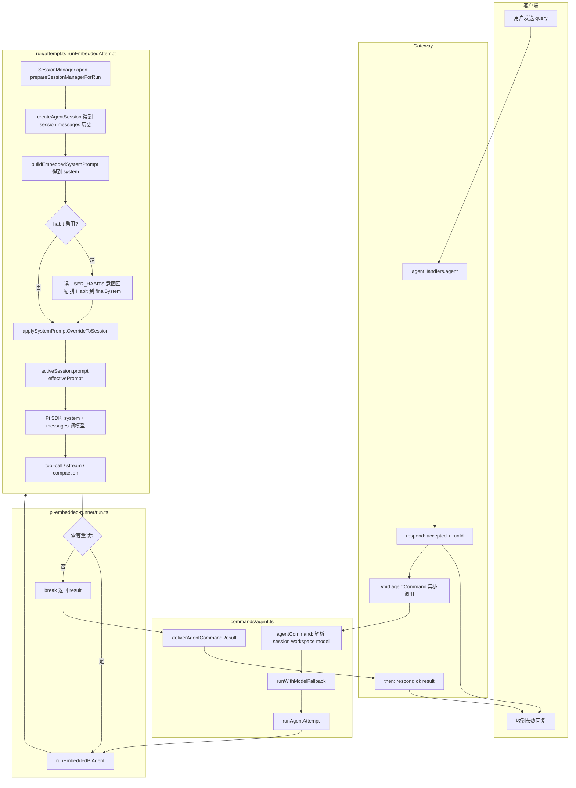

# User Habit Plan — 意图+结果记忆与 Habit Prompt

本文档记录「用户行为习惯记忆」方案的设计结论，用于后续实现参考。

---

## 1. 实体与范围

- **实体**：USER。
- **载体**：`USER.md` 中除基础信息外，增加**用户习惯**——即「在什么意图下，用户期望得到什么结果」。
- **示例**：用户说「把 xxx 文件发给我」→ 意图：发文件；结果：使用「发文件」类技能（如 send-file）把具体文件发出去。
- **两个子任务**：
  1. **意图识别**：从 query 中识别用户意图（如「发文件」）。
  2. **结果识别**：识别用户期望的**实现方式/结果**（如「用某个技能」）。

---

## 2. 记录时机

1. **实时**：用户在 query 里**明确**说出「某个意图要用某个技能/结果」时，当即记录。
2. **离线**：**每晚**一次调度，总结当日对话中的意图与最终实现的结果，写入习惯库。

---

## 3. 整体流程（三阶段）

### 阶段一：接到 query 后立即做「意图+结果」识别

- 输入：当前用户 query。
- 输出：本轮的 (intent, result)。
- 识别方式：**LLM**（可后续增加向量检索作为补充）。

### 阶段二：与已有习惯匹配

- 输入：`USER.md` 中已记录的 (intent, result) 列表 + 当前 query。
- 目的：判断当前 query 能否**命中**某条已有习惯。
- 实现方式（二选一或组合）：
  - **方案 A（优先）**：**LLM 一次完成**——把 `USER.md` 内容 + 当前 query 一起给 LLM，让 LLM 同时完成：
    - 从 query 中识别 (intent, result)；
    - 与已有条目做匹配。
  - **方案 B（效果不好再上）**：用**向量库**对「意图」做语义检索，相关度重排后取匹配，**不**再把检索结果交给 LLM 做二次判断。

- **意图名**：全局统一命名（不固定列表，但全局唯一）。
- **结果**：区分「来自当前 query 的结果」与「来自已有习惯的结果」。
  - 若 query 里**有明确结果** → 优先用 query 的结果做阶段三。
  - 若 query 里**没有明确结果** → 用匹配到的已有结果做阶段三。

### 阶段三：注入 Habit Prompt

- 若得到 (intent, result)，将其固化为一个**独立提示词模块**：「Habit Prompt」。
- 该模块与 System Prompt、messages **并列**，作为独立部分一起发给主模型。
- 主模型在生成回复时，可据此优先按用户习惯执行（如：发文件 → 用 send-file 技能）。

---

## 4. 实现约束与约定

### 4.1 独立性与开关

- Habit 相关逻辑（意图识别、匹配、Habit Prompt）是**独立于** system 与 user 消息的**独立部分**。
- 提供**配置开关**控制是否启用，**默认关闭**。

### 4.2 存储与写入

- **实时识别**到的 (intent, result)：**直接写文件**（如 `USER.md` 或专用习惯文件）。
- **是否写入 DB**：由配置决定；若配置未开启 DB 存储，则只写文件。
- **夜间总结**：主要梳理 memory 相关部分，将当日归纳的 (intent, result) **追加**到习惯存储（文件/DB）。
- **结构**：固定格式，便于解析与合并（具体结构可后续定，如 YAML 块或固定 Markdown 小节）。

### 4.3 重复意图的优先级

- 同一意图出现多次时，需能区分**时间先后**。
- 规则：**后发生的覆盖先发生的**（以最新一次为准）。
- 若无法区分时间：**实时优先于离线**（实时识别结果优先于夜间总结结果）。

### 4.4 意图列表与重命名

- **intent 用自然语言**：意图名应为用户意图的自然语言表述（如「发文件」「提醒」），不用技能名或英文 ID；**result** 描述实现方式（如「用 send-file 技能」）。便于匹配与可读。
- **意图列表不固定**：意图名只需**全局唯一**即可（命名规范与重命名迁移详见 7.3）。
- **重命名**：若某意图会改名（如合并、拆分），需要同时保留**原名**与**新名**，并在全量习惯数据中做**统一替换**，避免历史记录断裂。
- 若用向量库：检索对象是**意图**；改名时需在向量库中同步（如更新或重建索引）。

### 4.5 向量库与 LanceDB

- 若采用**向量匹配**，可**复用现有 LanceDB**，但习惯数据建议用**单独的表/命名空间**，与现有 memory 表区分。
- 配置上：是否需要**单独开关/配置**（如 `habit.useLanceDB`、`habit.tableName`），与 memory-lancedb 的配置分离，便于独立开关与扩展。

### 4.6 Result 形态

- **Result 不区分 type**：形态多样（技能名、自然语言描述、操作序列等均可）。
- 约定：只要表达「某意图下用户希望得到 xxx」，就把 **xxx 原样记下来**，不做类型枚举或强约束。

### 4.7 注入顺序（实现约定）

- 发给主模型时，三者的**顺序约定**为：**System → Habit Prompt → messages**。
- 若底层只支持一条 system（如当前 Pi session 的 `setSystemPrompt`），则将 Habit Prompt 拼在 System 字符串末尾，即 `finalSystem = System + "\n\n" + HabitPrompt`，再传入；顺序仍等价为 System 在前、Habit 在中、messages 在后。

### 4.8 单条 query 多意图（返回数组）

- 一条用户消息可能包含**多个意图**（如「发我文档，顺便提醒明天开会」→ 发文件 + 提醒）。
- 阶段一+二的 LLM 输出约定为 **数组**：`[{"intent": "...", "result": "..."}, ...]`；实现上兼容单对象 `{...}` 并规范化为数组。
- 同一 intent 在数组中出现多次时只保留第一条（按顺序去重），便于下游拼 Habit Prompt 时无重复。

### 4.9 习惯膨胀（后续可做）

- 实时写入 + 新增条目可能导致 `USER_HABITS.yaml` 条数持续增多（习惯膨胀）。
- 当前已通过 **intent/alias 匹配** 减少同义重复写入；若 LLM 多次用不同 intent 名指同一习惯，仍可能产生多条。
- 后续如需控制规模：可考虑条数上限、周期性按语义合并/去重、或提供手动整理/归档入口；暂不实现，仅作约定记录。

### 4.10 智谱 GLM thinking 模式

- 智谱 GLM-5 / GLM-4.7 等模型**默认开启 thinking**，API 会返回 `reasoning_content`/thinking 块，可能不返回或延后返回普通 text 块。
- 习惯识别只需一轮、期望直接得到 JSON，因此对 **zai provider 或 model id 含 glm** 的模型，在调用意图识别 LLM 时通过请求体传入 `extra_body: { thinking: { type: "disabled" } }` 关闭 thinking，避免只拿到 reasoning 内容。参见 [智谱思考模式文档](https://docs.bigmodel.cn/cn/guide/capabilities/thinking-mode)。
- 若 SDK 不支持 `extra_body` 透传，则依赖已有兜底：从 thinking/reasoning 文本中用正则抽取 intent/result（见 `recognize.ts` 中 `extractFromReasoningText`）。

---

## 5. 主 Agent 的角色（待澄清）

- 文档中「主 agent」指：在接到用户 query 后，负责**执行对话与工具调用**的 agent（即当前 OpenClaw 中跑 system prompt + messages 的那条链路）。
- Habit 模块的职责：在**主 agent 正式推理前**，先做意图+结果识别与匹配，并生成 Habit Prompt；主 agent 将「System + Habit Prompt + messages」一起用于本轮推理。

---

## 6. 与现有组件的衔接（简要）

| 组件                 | 关系                                                                                 |
| -------------------- | ------------------------------------------------------------------------------------ |
| **USER_HABITS.yaml** | 习惯条目存储在工作区内的 `USER_HABITS.yaml`（见 7.1）。                              |
| **memory-lancedb**   | 若启用习惯的向量匹配，可复用同一 LanceDB 实例、不同表；配置需可独立。                |
| **System Prompt**    | Habit Prompt 与 system 并列注入，不替换 system。                                     |
| **夜间调度**         | 需有定时任务/ cron 或类似机制，只做「当日意图+结果总结」并追加写入，不覆盖实时写入。 |

---

## 7. 习惯存储的具体文件/表结构（推荐）

### 7.1 文件存储（主推荐）

- **路径**：工作区内单独文件 `USER_HABITS.yaml`，与 `USER.md` 同级；便于版本管理、人工查看与编辑。
- **格式**：YAML，利于程序解析与合并。
- **字段**（单条习惯）：
  - `intent`（必填）：意图名，全局唯一，字符串。
  - `result`（必填）：该意图下用户期望的结果，字符串，形态不限定（技能名、自然语言、操作描述等均可）。
  - `updatedAt`（必填）：最后更新时间，Unix 毫秒时间戳或 ISO8601 字符串；用于「后发生的覆盖先发生的」。
  - `source`（可选）：`realtime` | `nightly`，用于无法区分时间时「实时优先于离线」。
  - `alias`（可选）：字符串数组，意图重命名前的曾用名，便于匹配历史与迁移（见 4.4）。

同一 `intent` 出现多条时取 `updatedAt` 最大的一条。

**示例（`USER_HABITS.yaml`）**：

```yaml
habits:
  - intent: 发文件
    result: 使用 send-file 技能把具体文件发到当前会话
    updatedAt: 1730000000000
    source: realtime
  - intent: 查日历
    result: 先查日历再回复
    updatedAt: 1729900000000
    source: nightly
```

### 7.2 表结构（LanceDB，可选）

仅在启用习惯向量匹配（方案 B 或与 LLM 组合）时使用；与 memory 表分离，单独表名（如 `habit_intents`）。

| 字段           | 类型    | 说明                                 |
| -------------- | ------- | ------------------------------------ |
| `id`           | string  | 主键，UUID。                         |
| `intent`       | string  | 意图名，全局唯一。                   |
| `result`       | string  | 该意图下期望的结果。                 |
| `intentVector` | float[] | 意图文本的 embedding，用于语义检索。 |
| `updatedAt`    | number  | Unix 毫秒时间戳，用于覆盖与排序。    |
| `source`       | string  | 可选，`realtime` \| `nightly`。      |

- 写入时：同一 `intent` 若已存在，可先按 intent 查出行再更新（或 delete + insert），保证「后覆盖前」。
- 检索时：用当前 query 的 embedding 在 `intentVector` 上做向量检索，再按 `updatedAt` 取最新。

### 7.3 意图名命名规范与重命名迁移

**命名规范（建议）**：

- **唯一性**：同一工作区内意图名全局唯一，不可重复。
- **形态**：不强制中/英，以「简短、可读、便于匹配」为准；推荐 2～8 个词（或等价中文），如 `发文件`、`查日历`、`send-file`。
- **风格**：若用英文，建议小写 + 连字符（如 `send-file`）；若用中文，避免与 result 长句混淆，意图名宜为名词或动宾短语。
- **避免**：不要用纯数字、纯符号，或与 result 内容完全相同的长句作为意图名。

**重命名时的迁移步骤**：

1. **更新 YAML**：在 `USER_HABITS.yaml` 中，将需要改名的条目的 `intent` 改为新名，并在该条目的 `alias` 中**追加**原名（若已有 `alias` 则合并，避免重复）。若同一文件内有多条同名旧意图，只保留一条（按 `updatedAt` 取最新），其余视为历史已合并。
2. **全量替换**：若有其他引用意图名的地方（如脚本、配置），全局搜索原名并改为新名。
3. **向量库同步**（若启用习惯 LanceDB）：对该意图对应行更新 `intent` 与 `intentVector`（用新意图名重新做 embedding）；或删除旧行并插入新行，保证表中唯一 intent 对应最新 `updatedAt`。
4. **匹配逻辑**：阶段二匹配时，若当前条目的 `intent` 与 query 识别结果一致则命中；若不一致，可用 `alias` 再匹配一次，命中后以当前条目的 `intent` 与 `result` 为准（即匹配到「曾用名」时仍按新意图处理）。

---

## 8. 配置项清单（建议）

建议放在 `agents.defaults.habit` 下（与 `heartbeat`、`compaction` 同级），便于按 agent 区分、与现有配置风格一致。

| 配置路径                                 | 类型    | 默认值                                     | 说明                                                               |
| ---------------------------------------- | ------- | ------------------------------------------ | ------------------------------------------------------------------ |
| `agents.defaults.habit.enabled`          | boolean | `false`                                    | 是否启用习惯模块（意图识别、匹配、Habit Prompt 注入）。            |
| `agents.defaults.habit.filePath`         | string  | （工作区内 `USER_HABITS.yaml`）            | 习惯 YAML 文件路径；可为相对工作区的路径或绝对路径。               |
| `agents.defaults.habit.useLanceDB`       | boolean | `false`                                    | 是否同时写入/使用 LanceDB 做习惯向量匹配（方案 B 或与 LLM 组合）。 |
| `agents.defaults.habit.tableName`        | string  | `habit_intents`                            | 仅当 `useLanceDB === true` 时生效；习惯表名，与 memory 表分离。    |
| `agents.defaults.habit.nightly.enabled`  | boolean | `false`                                    | 是否启用夜间总结（当日意图+结果归纳并追加写入）。                  |
| `agents.defaults.habit.nightly.at`       | string  | `"02:00"`                                  | 每日执行时间，24 小时制 `HH:mm`（本地或由下方 timezone 解释）。    |
| `agents.defaults.habit.nightly.timezone` | string  | `"user"` 或与 agent 的 `userTimezone` 一致 | 用于解释 `at` 的时区（`"user"` 表示用 agent 的 userTimezone）。    |

**说明**：

- **开关**：仅当 `habit.enabled === true` 时，阶段一～三与 Habit Prompt 注入才生效；默认关闭，避免对现有用户产生行为变化。
- **DB**：`useLanceDB` 为 true 时，需已有可用的 LanceDB 实例（如已启用 memory-lancedb）；习惯数据写入 `tableName` 指定表，与 memory 表隔离。
- **夜间任务**：可用现有 cron 机制注册一条每日定时任务，在 `habit.nightly.at` 对应时间触发「当日意图+结果总结」并追加到 `filePath`（及可选 DB）；若未实现 cron 集成，可先只做文件追加、由外部 cron 调用 CLI 触发。

---

## 9. 与主 agent、gateway 的调用顺序与接口形态

### 9.1 调用顺序（推荐）

当前链：**Gateway 收到 agent 请求** → **agentCommand** → **runEmbeddedPiAgent** → **runEmbeddedAttempt**（构建 system、加载 session、循环：把用户 prompt 送入 session 并 stream 推理）。

习惯模块插入位置（在**主 agent 正式推理之前**完成）：

1. **Gateway** 收到 `agent` 请求（含 `message`），不做习惯相关逻辑，照常校验、解析、注入时间戳等，然后调用 **agentCommand**。
2. **agentCommand** 调用 **runEmbeddedPiAgent**，传入 `prompt`、`sessionFile`、`workspaceDir`、`config` 等；不要求 gateway 或 command 层传入 `habitPrompt`。
3. **runEmbeddedAttempt** 内（在构建 system、创建/加载 session 之后，在**第一次把用户 prompt 送入 agent 并开始 stream 之前**）：
   - 若 `config.agents?.defaults?.habit?.enabled !== true`，不跑习惯逻辑，system 保持仅当前 `buildEmbeddedSystemPrompt` 结果。
   - 若启用：先读 `USER_HABITS.yaml`（路径由 `habit.filePath` 或默认工作区内），用当前 **prompt** 做阶段一（意图+结果识别）与阶段二（与已有习惯匹配），得到本轮的 **Habit Prompt** 字符串；再将 **finalSystem = System + "\n\n" + Habit Prompt**，用 `applySystemPromptOverrideToSession(session, finalSystem)` 写回 session；此后主 agent 用该 finalSystem + messages 做推理。

因此：**Gateway 与 agentCommand 无需新接口**；习惯的入参仅为 attempt 内已有的 `prompt`、`workspaceDir`、`config` 及可选 `sessionKey`，输出为追加到 system 的 Habit Prompt 字符串。

### 9.2 接口形态（实现约定）

- **调用方**：`runEmbeddedAttempt` 内部（或其调用的 habit 子模块）。
- **输入**：当前用户 query（即本轮的 `params.prompt`）、工作区路径（用于读 `USER_HABITS.yaml`）、`config`（读 `habit.enabled`、`habit.filePath`、`habit.useLanceDB` 等）、可选 `sessionKey`（若后续按 session 区分习惯）。
- **输出**：**Habit Prompt** 字符串（可能为空）。若为空或未启用习惯，则 `finalSystem = System`；否则 `finalSystem = System + "\n\n" + habitPrompt`。
- **可选扩展**：若希望 gateway 或 CLI 能**预计算** Habit Prompt（例如在别处跑 LLM），可增加 `runEmbeddedPiAgent` / `runEmbeddedAttempt` 的入参 `habitPrompt?: string`；若传入则跳过 attempt 内习惯 pipeline，直接使用该字符串拼到 system 末尾。当前建议以 attempt 内计算为主，该扩展留作后续可选。

---

## 附录：Gateway 收到用户 query 到返回结果的主要阶段

从 Gateway 收到用户消息到把最终结果返回给用户，大致经过以下阶段和方法（嵌入式 Pi 主路径；CLI 后端路径略）。

### 流程图（Mermaid）

在支持 Mermaid 的预览（GitHub、VS Code、Mintlify 等）中可看到流程图。



**图例要点**：左侧「客户端」先收到 `accepted`；右下 **runEmbeddedAttempt** 框内为顺序：从 session 文件加载 **messages（历史）** → 构建 **system** → 若启用习惯则拼 **Habit Prompt** → 写入 session → **prompt(effectivePrompt)** 追加本轮 user → Pi SDK 以 **(system, messages)** 调模型 → 结果经 run → agentCommand → gateway 再 **respond(ok, result)** 回到用户。

---

| 阶段                                                     | 位置 / 方法                                                                                                | 作用或描述                                                                                                                                                                                                                                                                                                                                                                                                                                                                                                                                                                                                                                                                                                                                                                                                                   |
| -------------------------------------------------------- | ---------------------------------------------------------------------------------------------------------- | ---------------------------------------------------------------------------------------------------------------------------------------------------------------------------------------------------------------------------------------------------------------------------------------------------------------------------------------------------------------------------------------------------------------------------------------------------------------------------------------------------------------------------------------------------------------------------------------------------------------------------------------------------------------------------------------------------------------------------------------------------------------------------------------------------------------------------- |
| **1. 入口与校验**                                        | `src/gateway/server-methods/agent.ts` 的 `agentHandlers.agent`                                             | 校验参数、解析 sessionKey/channel、处理 /new /reset、解析附件与时间戳注入；决定 delivery 目标（channel、to、threadId 等）。                                                                                                                                                                                                                                                                                                                                                                                                                                                                                                                                                                                                                                                                                                  |
| **2. 立即应答「已接受」**                                | 同上，`respond(true, { runId, status: "accepted" })`                                                       | 先向客户端返回「请求已接受」和 `runId`，避免客户端超时；实际推理在后台执行。                                                                                                                                                                                                                                                                                                                                                                                                                                                                                                                                                                                                                                                                                                                                                 |
| **3. 发起 Agent 命令**                                   | 同上，`void agentCommand({ message, sessionKey, ... }, runtime, deps)`                                     | 异步调用 agent 命令，不阻塞；完成后通过 `.then(result)` 再发一次 `respond` 把最终结果给用户。                                                                                                                                                                                                                                                                                                                                                                                                                                                                                                                                                                                                                                                                                                                                |
| **4. 会话与运行准备**                                    | `src/commands/agent.ts` 的 `agentCommand`                                                                  | 解析 session（sessionId、sessionKey、sessionFile、workspaceDir）、加载配置与 model、解析 thinking/verbose、确保 workspace 与 bootstrap 文件、构建 skillsSnapshot；若有 model fallback 则包一层 `runWithModelFallback`。                                                                                                                                                                                                                                                                                                                                                                                                                                                                                                                                                                                                      |
| **5. 执行单次 Run（Pi 或 CLI）**                         | `runAgentAttempt`（同上）→ `runEmbeddedPiAgent` 或 `runCliAgent`                                           | 根据 provider 选择嵌入式 Pi 或 CLI 后端；Pi 路径进入 `run.ts` 的 `runEmbeddedPiAgent`。                                                                                                                                                                                                                                                                                                                                                                                                                                                                                                                                                                                                                                                                                                                                      |
| **6. 多轮 Attempt 与重试**                               | `src/agents/pi-embedded-runner/run.ts` 的 `runEmbeddedPiAgent`                                             | `while (true)` 内调用 `runEmbeddedAttempt`；根据返回的 overflow/超时/compaction 等决定是否换模型或重试，否则 break 并带上 `payloads`、`meta` 等返回。                                                                                                                                                                                                                                                                                                                                                                                                                                                                                                                                                                                                                                                                        |
| **7. 单次 Attempt：建 system、加载 session、跑一轮推理** | `src/agents/pi-embedded-runner/run/attempt.ts` 的 `runEmbeddedAttempt`                                     | **Messages 的由来**：通过 `SessionManager.open(sessionFile)` 与 `prepareSessionManagerForRun` 从 session 文件（JSONL transcript）加载**已有对话历史**，再经 `createAgentSession(..., sessionManager, ...)` 得到 Pi session，其 `activeSession.messages` 即为当前历史。**System**：`buildEmbeddedSystemPrompt` 得到 system 字符串，`applySystemPromptOverrideToSession(session, systemPromptText)` 设到 session（此处可先拼上 Habit Prompt）。**本轮用户消息**：`activeSession.prompt(effectivePrompt)` 会把本轮用户内容追加到 session 的 messages，随后 Pi SDK 用 **(system, messages)** 调模型完成多轮 tool-call/stream；等待 compaction 等；返回本轮的 `aborted`、`promptError`、`lastAssistant`、`messagesSnapshot` 等。习惯模块应在 `prompt(effectivePrompt)` 之前插入（读 USER_HABITS、意图匹配、拼 Habit 到 system）。 |
| **8. 结果回写与投递**                                    | `agentCommand` 末尾 `deliverAgentCommandResult`                                                            | 用 `result.payloads` 和 `result.meta` 更新 session store（如 token 使用、model）；若 `opts.deliver === true` 则通过 channel 把回复真正发到用户（如 Telegram/ Discord）；返回给调用方的结构会作为 gateway 的 `result`。                                                                                                                                                                                                                                                                                                                                                                                                                                                                                                                                                                                                       |
| **9. 最终响应给用户**                                    | `agent.ts` 中 `agentCommand(...).then((result) => { ... respond(true, { runId, status: "ok", result }) })` | 把「完成」状态和包含 payloads/meta 的 `result` 通过 `respond` 发回客户端，用户端据此展示回复或做后续处理。                                                                                                                                                                                                                                                                                                                                                                                                                                                                                                                                                                                                                                                                                                                   |

**小结**：用户 query 先经 gateway 校验并立即得到「accepted」；实际推理在 **agentCommand → runEmbeddedPiAgent → runEmbeddedAttempt** 中完成。**Messages** 在 **runEmbeddedAttempt** 内：历史来自 session 文件（SessionManager 从 JSONL 加载），本轮用户内容由 `prompt(effectivePrompt)` 追加；发给模型时即为 **(system, messages)**，其中 system 在本步构建并写入 session，messages = 历史 + 本轮 user。习惯模块若启用，应在 `prompt(effectivePrompt)` 之前插入（见 9.1）。

---

## 10. 实现步骤（分步落地）

按「小步可测、逐步加码」的方式拆成以下步骤；每步做完可单独验证再进入下一步，避免一次性改太多卡住。

| 步骤                                    | 内容                                                                                                                                                                                                                                                                                                                                                                                                                                                                      | 验收方式                                                                                                                                             |
| --------------------------------------- | ------------------------------------------------------------------------------------------------------------------------------------------------------------------------------------------------------------------------------------------------------------------------------------------------------------------------------------------------------------------------------------------------------------------------------------------------------------------------- | ---------------------------------------------------------------------------------------------------------------------------------------------------- |
| **1. 配置与开关**                       | 在 `agents.defaults` 下增加 `habit` 配置：`enabled`（默认 `false`）、`filePath`（默认工作区内 `USER_HABITS.yaml`）。在现有 config schema（如 `zod-schema.agent-defaults.ts` 或对应 schema）里声明类型，不实现逻辑。                                                                                                                                                                                                                                                       | 配置可写、可读、默认关闭；`pnpm build` 与相关单测通过。                                                                                              |
| **2. 注入管线占位**                     | 在 `runEmbeddedAttempt` 内，在 `applySystemPromptOverrideToSession` 之前：若 `config.agents?.defaults?.habit?.enabled === true`，调用一个占位函数（如 `buildHabitPrompt({ prompt, workspaceDir, config })`），返回空字符串；将 `finalSystem = systemPromptText + (habitPrompt ? "\n\n" + habitPrompt : "")`，再对 session 调用 `applySystemPromptOverrideToSession(session, finalSystem)`；否则保持现有 `applySystemPromptOverrideToSession(session, systemPromptText)`。 | 默认关闭时行为不变；开启时 system 多拼一段空字符串也不影响模型，可打 log 或单测断言「当 enabled 且占位返回空时 finalSystem 比 system 多一个 \n\n」。 |
| **3. USER_HABITS.yaml 读写**            | 实现习惯文件的 **读**：解析 YAML（`habits` 数组，元素含 `intent`、`result`、`updatedAt`、可选 `source`、`alias`）；同一 intent 多条时取 `updatedAt` 最大的一条。实现 **写**（可选）：追加或按 intent 更新一条。抽成独立模块（如 `src/agents/habit/storage.ts`），带单测（读空文件、读合法 YAML、写再读）。                                                                                                                                                                | 单测覆盖解析与「同一 intent 取最新」；在 attempt 里能根据 `habit.filePath` 解析到习惯列表（本步仍不拼进 prompt，或只拼固定测试串）。                 |
| **4. 阶段一 + 阶段二（LLM 一次）**      | 实现「从当前 query + 已有习惯列表 → 得到本轮的 (intent, result) 或匹配到的习惯 result」：用 **一次 LLM 调用**（方案 A），输入为 prompt + 习惯列表（可格式化为简短文本），输出为结构化 (intent, result) 或空；若 query 有明确结果用 query 的，否则用匹配到的习惯的 result。LLM 可用现有推理基础设施（注意控制 token、超时）。                                                                                                                                              | 单测：给定 mock 的 LLM 返回，能解析出 (intent, result)；或集成小测试：写死一条习惯，发一句 query，看返回的 result 是否符合预期。                     |
| **5. 阶段三：拼 Habit Prompt**          | 将 (intent, result) 转成发给主模型的 **Habit Prompt 字符串**（简短自然语言，如「用户习惯：当意图为『发文件』时，请优先按以下方式执行：…」）。在步骤 2 的占位处改为调用本逻辑：读习惯文件 → 阶段一+二 → 拼 Habit Prompt → 拼到 system。                                                                                                                                                                                                                                    | 开启 habit、在 USER_HABITS.yaml 写一条习惯、发相关 query，看主模型回复是否更符合习惯（或至少 system 中包含该习惯描述）。                             |
| **6. 实时写入（可选）**                 | 当本轮识别到「用户明确说了要用某技能/某结果」时，在当轮结束后将 (intent, result) 写入或更新 `USER_HABITS.yaml`（含 `updatedAt`、`source: realtime`）；注意与「同一 intent 取最新」的读逻辑一致。                                                                                                                                                                                                                                                                          | 手动或单测：触发一次明确习惯表达，检查文件是否新增/更新且格式正确。                                                                                  |
| **7. 夜间总结与 LanceDB（可选，后做）** | 夜间任务：读当日对话摘要或 memory，归纳 (intent, result)，追加到习惯文件（`source: nightly`）。若启用 `habit.useLanceDB`，再实现表结构与向量检索（方案 B 或与 LLM 组合）；表名用 `habit.tableName`。                                                                                                                                                                                                                                                                      | 可先不做，或只做「定时任务调一个 CLI/内部接口，写一条测试习惯到文件」的占位。                                                                        |

**建议顺序**：先做 **1 → 2 → 3**，保证「配置 + 管线 + 文件格式」打通且可测；再做 **4 → 5** 接入 LLM 与 Habit Prompt 内容；**6、7** 视需要再上。每步提交前跑一遍 `pnpm build` 与相关单测，避免积压问题。
